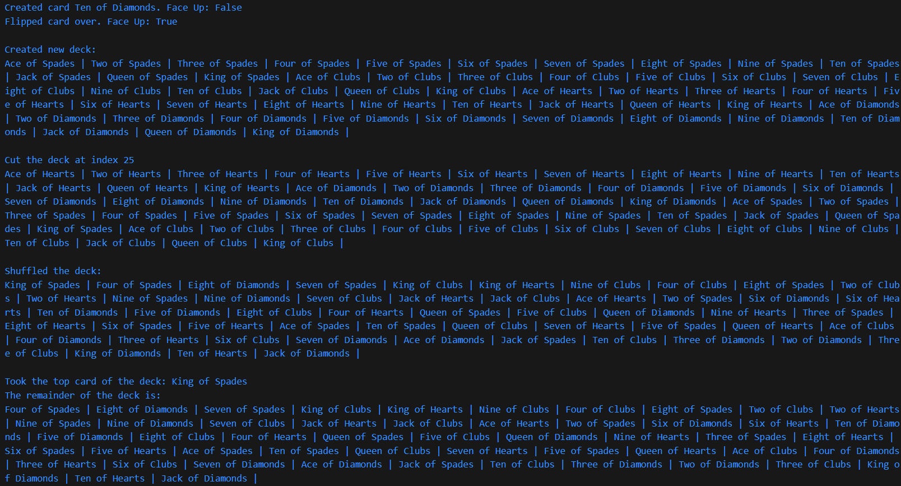

Joseph Collado
Homework 4 Part 1 for CSC 350H @ BMCC

Assignment Instructions:
1. Card/Deck class: [Rank.cs, Suit.cs, Card.cs(unfinished), Deck.cs(unfinished)] are provided, please complete the implementation and test the code you have implemented.

Test Program Output:

